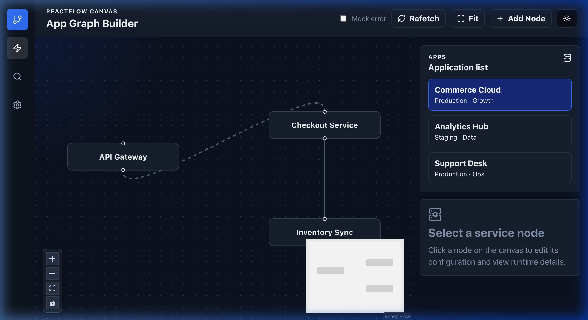

# App Graph Builder

**Live Demo** → [Add your GitHub Pages link here after deploying]

A polished, interactive microservice dependency graph visualizer built with React Flow.

Built as a complete submission for the **Frontend Intern** role.



## Design Reference & Approach

The provided reference was a dark-themed monitoring dashboard with service cards showing CPU, Memory, Disk, pricing, and status.

**My Implementation**:
- I built an **interactive service dependency graph** using ReactFlow — going beyond static cards while strongly matching the reference in the inspector.
- Rich node inspector with synced sliders for **CPU, Memory, Disk**, pricing, status badges, editable fields, and Config/Runtime tabs.
- Full **Dark Mode** support with theme toggle to match the premium dark aesthetic of the reference.
- This creates a more powerful, real-world architecture exploration tool.

## Features

| Feature                    | Description |
|---------------------------|-----------|
| Interactive Graph         | Drag, zoom, pan, select, delete nodes & edges |
| Responsive Dashboard      | Modern layout with mobile slide-over inspector |
| Rich Node Inspector       | Synced metric sliders (CPU, Memory, Disk), pricing, status, tabs |
| Modern Data Layer         | TanStack Query (loading, error, caching, refetch) |
| Clean Architecture        | TanStack Query + Zustand + local ReactFlow state |
| Polished UX               | Dark mode, micro-interactions, Add Node, Canvas Settings |

## Tech Stack
- React 18 + Vite + **Strict TypeScript**
- @xyflow/react (ReactFlow)
- TanStack Query + Zustand
- Custom UI components

## Setup

```bash
npm install
npm run dev
```

**Quality Checks**
```bash
npm run lint
npm run typecheck
npm run build
```

## Architecture Highlights

- **State Separation**: TanStack Query for server cache, Zustand for UI state, local useState for editable graph.
- **Inspector Sync**: Changes in sliders/inputs directly update the node data in ReactFlow.
- **Mock API**: Delayed responses + manual error simulation for easy demoing.

## Known Limitations

- Mock data resets on page refresh
- Changes are local only (no backend persistence)
- Error toggle is manual

---

Made by Rohan Joshi
